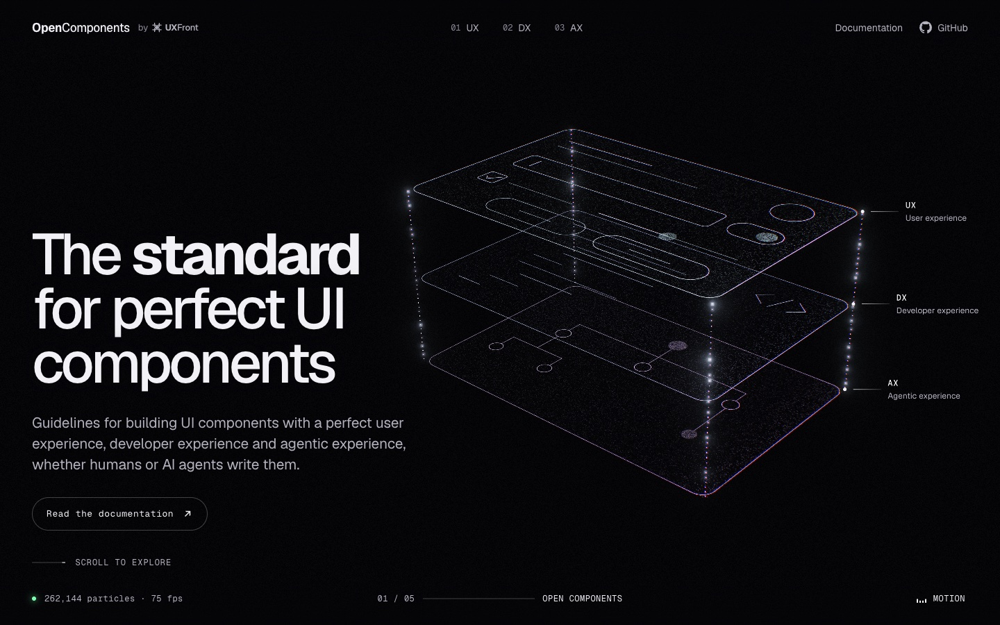

    

<h1 align="center">Open Components</h1>

    Open Components is the standard for perfect UI components: guidelines for building UI components with a perfect user experience, developer experience and agentic experience, whether humans or AI agents write them.   Open Components is part of <a href="https://uxfront.com">UXFront</a>, written and maintained by <a href="https://github.com/alexgrozav">@alexgrozav</a>.
     
     
     
    
     
     
     
    <a href="https://opencomponents.dev">Homepage</a>
    ·
    <a href="https://opencomponents.dev/docs">Documentation</a>
    ·
    <a href="https://opencomponents.dev/changelog">Changelog</a>
    ·
    <a href="https://opencomponents.dev/llms.txt">llms.txt</a>
    ·
    <a href="https://github.com/uxfront-com/open-components/issues">Issue Tracker</a>

 

    
    
    

 
 

## Table of contents

-   [The standard](#the-standard)
-   [Reading the standard](#reading-the-standard)
-   [For agents](#for-agents)
-   [Bugs and feature requests](#bugs-and-feature-requests)
-   [Contributing](#contributing)
-   [Creator](#creator)
-   [Copyright and license](#copyright-and-license)

## The standard

The standard has three layers, one for each audience a component serves. A component meets the
standard when it meets all three.

-   **User experience (UX)**: components behave the way people expect them to, with any input, on
    any device and for every ability. _Accessible, predictable, every state, adaptive._
-   **Developer experience (DX)**: one clear API, learned once and used everywhere. Knowing one
    component means knowing them all. _Consistent, type-safe, composable, controllable._
-   **Agentic experience (AX)**: components that AI agents can read, reason about and build with,
    so their output meets the same bar as yours. _Semantic, described, deterministic, verifiable._

Learn the guidelines once, then hold every component to the same high standards, whether you or
your agents write it.

## Reading the standard

Start with the [Introduction](https://opencomponents.dev/docs/getting-started/introduction), which walks through the three
layers and what each one asks of a component. The guidelines live as markdown in
[`content/docs/`](./content/docs), so you can also read them right here on GitHub.

## For agents

Every page of the documentation is also published as markdown, so agents can read the standard
and check their work against it:

-   `https://opencomponents.dev/raw/<path>.md` holds one page, as in
    [`/raw/docs/getting-started/introduction.md`](https://opencomponents.dev/raw/docs/getting-started/introduction.md) for the introduction.
-   `https://opencomponents.dev/raw/<path>.yaml` holds a page's contract, with every rule from its
    checklist, as in [`/raw/docs/components/button.yaml`](https://opencomponents.dev/raw/docs/components/button.yaml).
    It's every requirement in a fraction of the page's length.
-   [`/llms.txt`](https://opencomponents.dev/llms.txt) lists every page and every contract.
-   [`/llms-full.txt`](https://opencomponents.dev/llms-full.txt) holds them all in one file. Point
    your agent at it to give it the whole standard in one request.

## Bugs and feature requests

Found a bug on the site, a gap in the guidelines or an idea for a new one? Please first search for
existing and closed issues. If your problem or idea is not addressed yet,
[please open a new issue](https://github.com/uxfront-com/open-components/issues/new/choose).

## Contributing

Please read through our [contributing guide](./.github/CONTRIBUTING.md). There you can find how to
run the site locally, edit the guidelines and deploy.
Everyone taking part in the project agrees to follow our [Code of Conduct](./.github/CODE_OF_CONDUCT.md).

Thanks goes to these [wonderful people](https://github.com/uxfront-com/open-components/graphs/contributors)!

## Creator

### **Alex Grozav**

-   <https://github.com/alexgrozav>
-   <https://uxfront.com>

If you use Open Components in your daily work and feel that it has made your life easier, please
consider sponsoring me on [GitHub Sponsors](https://github.com/sponsors/alexgrozav). 💖

## Copyright and license

Copyright © 2026 [UXFront](https://uxfront.com). The site code is released under the
[MIT License](./LICENSE). The guidelines in [`content/`](./content) are released under the
[Creative Commons Attribution 4.0 License](./content/LICENSE): you can share and adapt them,
commercially too, as long as you credit Open Components.
